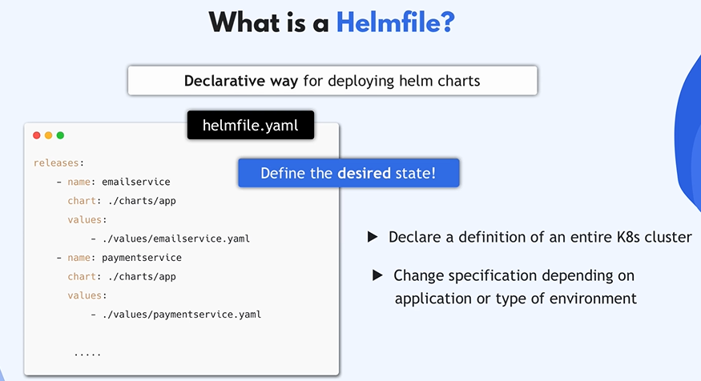
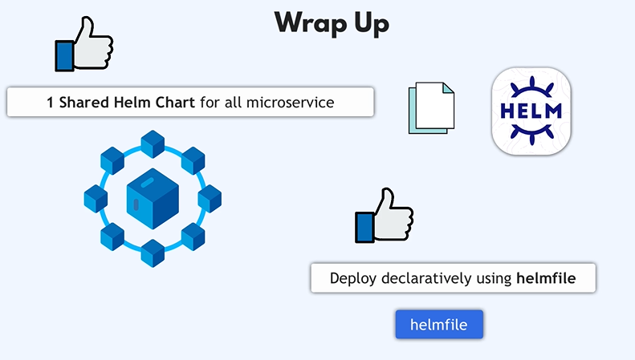
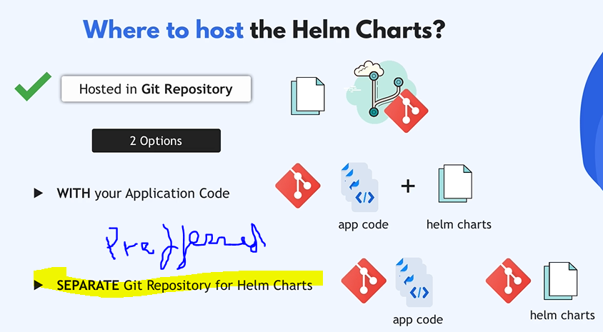

# Deploy MS with "helm install" one by one manully
```bash
helm install -f values/redis-values.yaml rediscart charts/redis
```
# if u hope to uninstall releas chart
```bash
helm uninstall chartRealise
```
## or put thos command in bash file install.sh
## put it executable 
```bash
chmod u+x install.sh
```
```bash
chmod u+x uninstall.sh
```
## excute.
```bash
./install.sh
```
```bash
./uninstall.sh
```
## if we want to check
```bash
helm ls
```
## using Helmfile declare what we want

## create helmfile
## install helmfile in windows command
 ```bash
 brew install helmfile
 ```
 # deploy helm chart
```bash
helmfile sync
```
# show releases
```bash
helmfile list
```
# uninstall all releases with one command 
```bash
helmfile destroy
```
# to check
```bash
helm ls 
```
## and pod are determinated
```bash
kubectl get pod
```
# review




