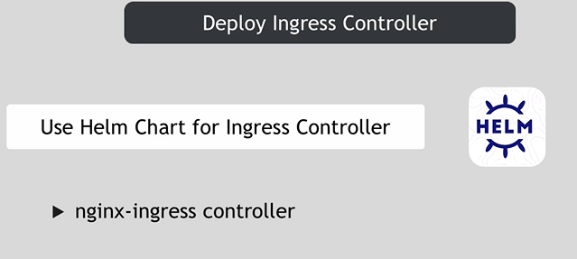
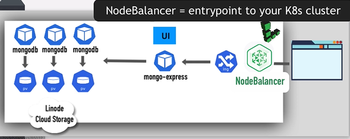

## overview

## Overview of what we build/deploy


# for the client configue nginx-ingress


 # the first state Deploy MongoDB

# there are two wways in first we find image ...

# search for files that tested deployed ..

# i search for mongodb helmchart
# to install helm from repo
```bash
helm repo add bitnami https://charts.bitnami.com/bitnami
```
## halm will use kubectl in background
# to sea all the chart this repo contains
```bash
helm search repo bitnami 
```
# search for mongodb 
```bash
helm  search repo bitnami/mongo
```

# sea conf file of mongodb.yml chart
### Rq:to connect to the cluster in the cloud just download the conf file then cree var en
```bash
expose KUBECONF=/download/file.yml
```
## to execute mongodb chart

```bash
helm install mongodb --value mongodb.yml bitnami/mongodb
```
# i have three pod ; and one pod manage replicas between those
# show everything 
```bash
kubectl get all
```
# show pod
```bash
kubectl get pod
```
# show secret
```bash
kubectl get secret
```
## now we gonna deploy mongo-express UI


## the service is a 

## for execute 
```bash
kubectl apply -f mongo-express.yml
```
# show pod
```bash
kubectl get pod
```
# to show connect or no
```bash
kubectl logs mong-express
```
# now we show 

# open mongo-express to browser to externel req , we gonna deploy ingress


# that's why i gonna search for k8s nginx 
```bash
helm repo add stable https://kubernetes-charts.storage.gooleapi.com/
```
## now installing the hem chart
```bash
helm install nginx-ingress stable/nginx-ingress --set controller.publishService.enabled=true
```
## check ingress-controller use some cloud native controller in Nodebalancer (the entrypoint that use externel ip adress forward req to ingress-controlle)
```bash
kubectl get pod
```

## now able to create hostname to route to some k8s service 

## now create ingress rule for mongo express
## apply ingress 
```bash
kubectl apply -f ingress.yaml
```
# check ingress
```bash
kubectl get ingress
```

## delete pod 
```bash
kubectl scale --replicas=0 statefulset/mongodb
```
## and created again
```bash
kubectl scale --replicas=3 statefulset/mongodb
```

# to remove all 
```bash
helm uninstall mongodb
```
# => data persist


