## we have same attribut with different value 
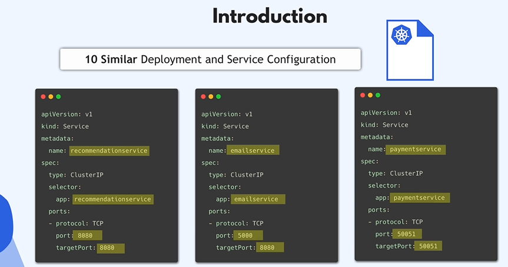
## the objective of helm chart 
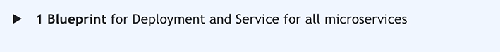

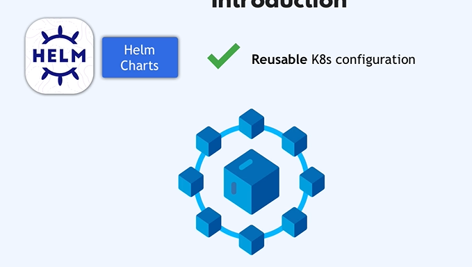
# there are two methode of useing helm chart that depends on your application 
# this methode is 
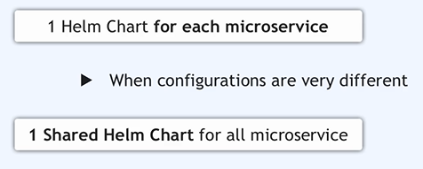
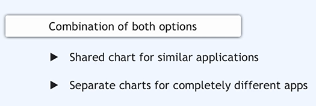
# in my case i would create 1 shared Helm chart that all MS used
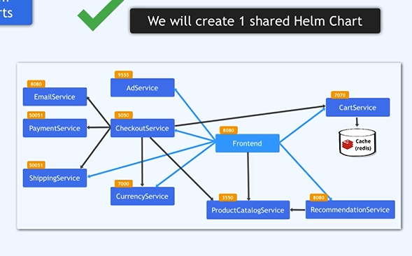
## between the manifest i tape in terminal 
```bash
helm create microservice
```
## basic structure of helm chart

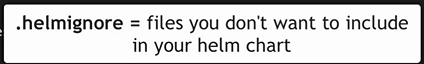
 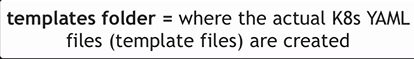
 # => 
 
  
  
 
 # 1.write my own template that's why i delete all files in template i put only service and deployement 
 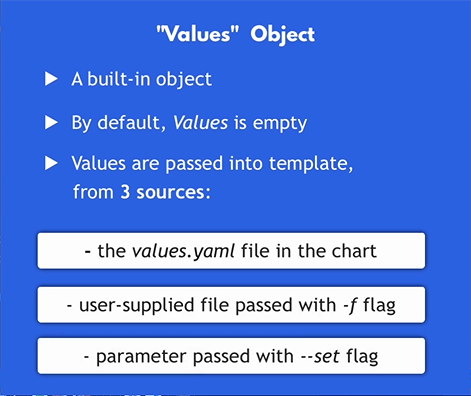
 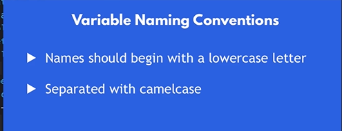
 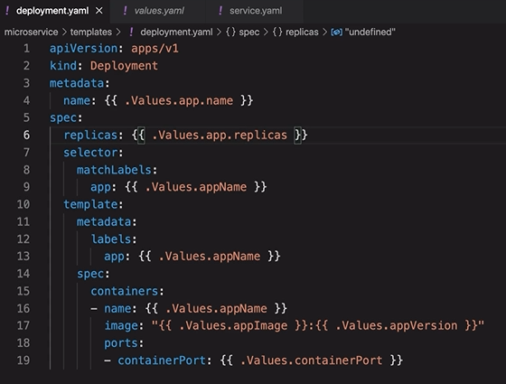
 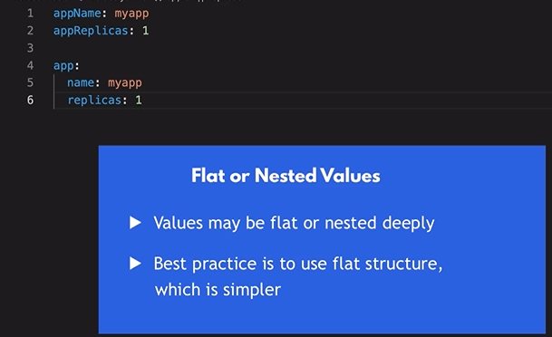
 # dynamique var 
 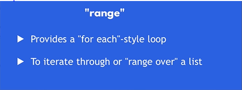
  
# to check chart => valide k8s yaml file

```bash
helm template -f servicename-service-values.yaml chartname
```
# validate a chart
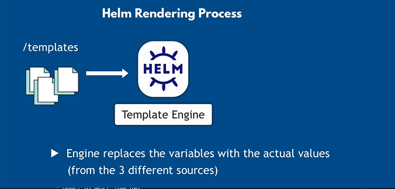
# rplce placehoder values in the template   
# from:
# -values ressources
# or 
# change values 
```bash
helm template -f servicename-service-values.yaml --set appReplicas=3 chartname
```
# helm collect the result of those template and send to k8s when execute helm install command
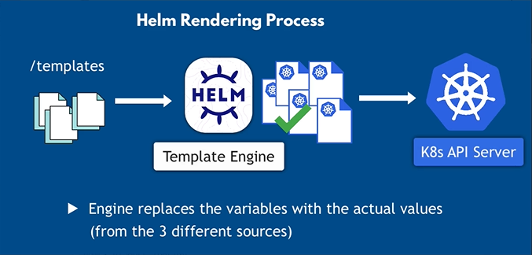
# to check validite and erreur in your chart of your yaml files

```bash
helm lint -f servicename-service-values.yaml chartname
```
## to deploy MS with chart 
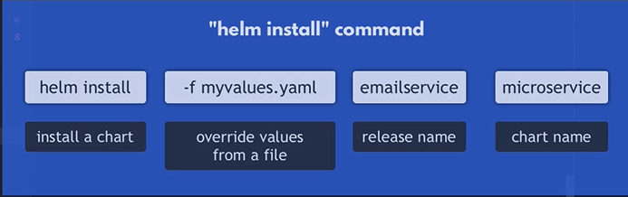
```bash
helm instal -f email-service-values.yaml emailservice microservice
```
# to show service chart 
```bash
helm ls
```
# to show pod that 2 repliccas
```bash
kubectl get pod
``` 
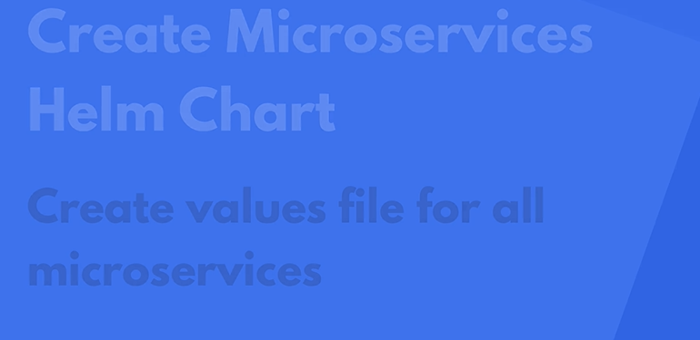
# you can put it in seperated foldder
### you can use 
```bash
helm instal -f values/email-service-values.yaml emailservice microservice
```

# i create folder charts inside it microserces 
# redis containers i have to create redis-cart
```bash
helm create redis
```
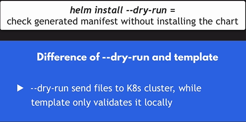
```bash
helm install --dry-run -f values/redis-values.yaml redisCart charts/redis
```


  