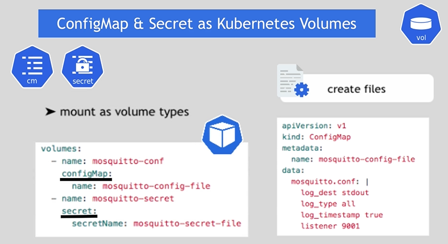
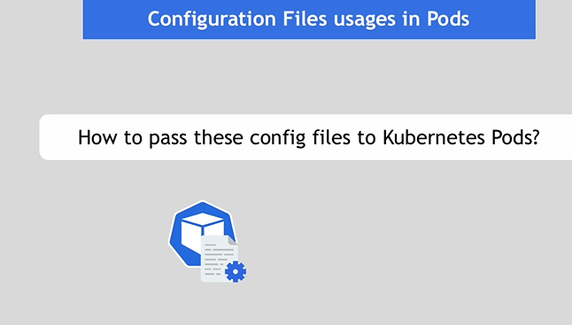
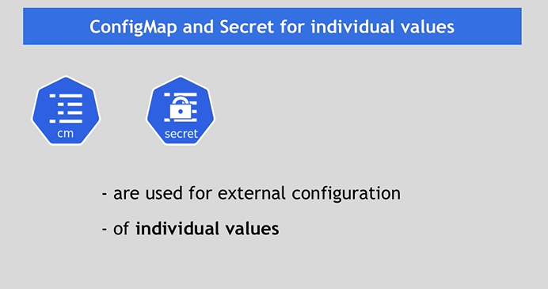
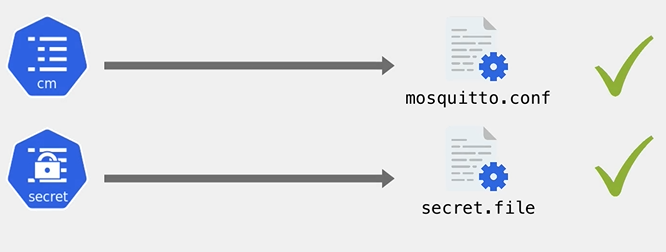
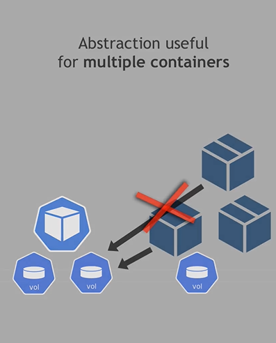
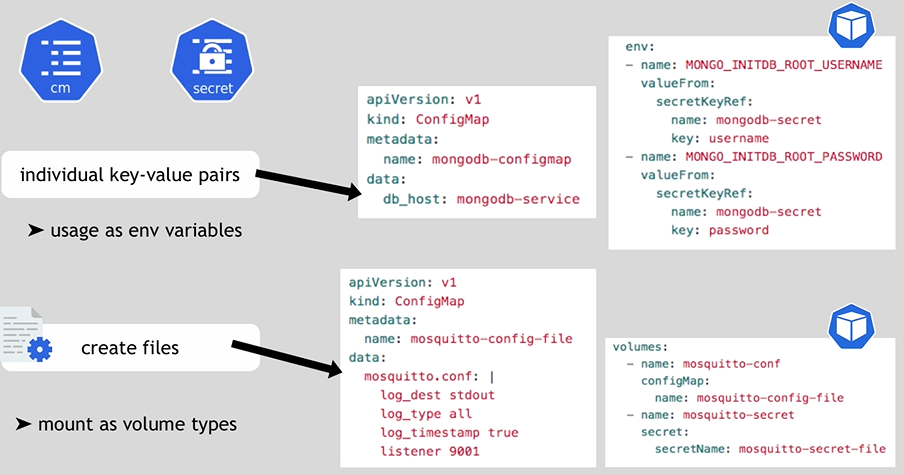
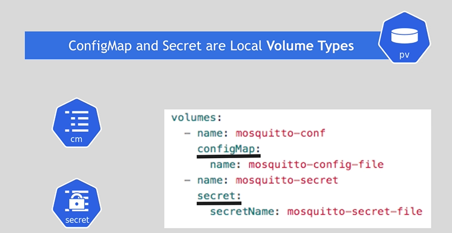

# app use externel config file or app communicate with 10 externel services that communicate wich all secure ; app needclientt certificat to communicate with internel secure service 


# files can be mond in the container and pod => the application in that container can access it ; demo folder


# => this run on minikube 
# aplly mosquitto pod
```bash
kubectl apply -f mosquitto-without-volumes.yaml
```
# enter in the pod configuration
```bash
kubectl get pod 
```
```bash
kubectl exec -it mosquitto-  -- /bin/sh 
```
# do ls
# i sea mosquitto per configure 
# i enter in mosquitto and i do ls 
# i show files exist per default  in image( config data log)
# i go to config and i do ls i sea a mosquitto.conf 
# i gonna delete i use 
```bash
kubectl delete -f mosquitto-without-volumes.yaml
```

# with configMap

# let'zs apply thes two 
```bash
kubectl apply -f config-file.yaml
```
```bash
kubectl apply -f secret-file.yaml
```
# check 
```bash
kubectl get secret
```
```bash
kubectl get configmap
```
# now

# we create mosquitto.yaml


# => becauce app running in the container


## review

