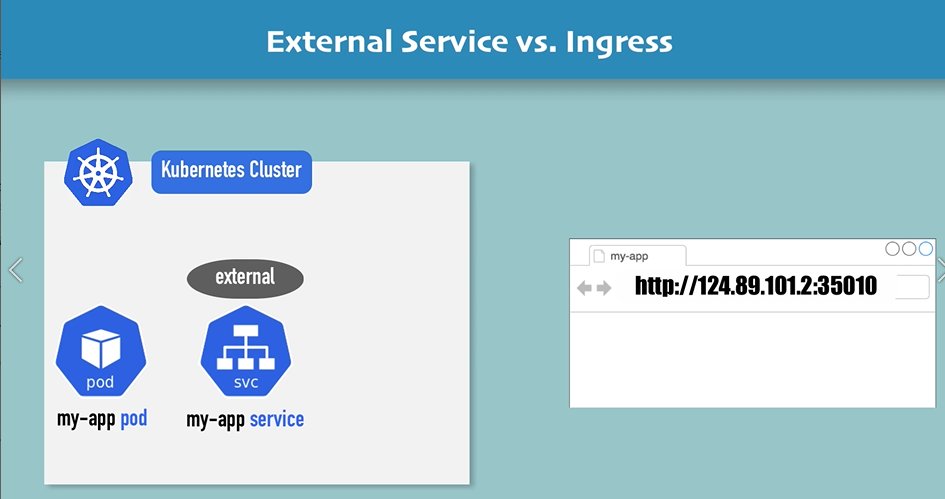
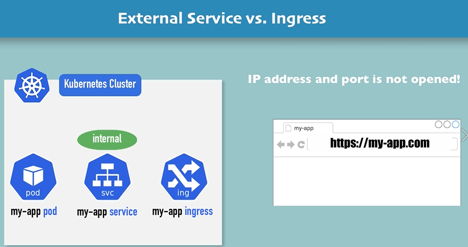
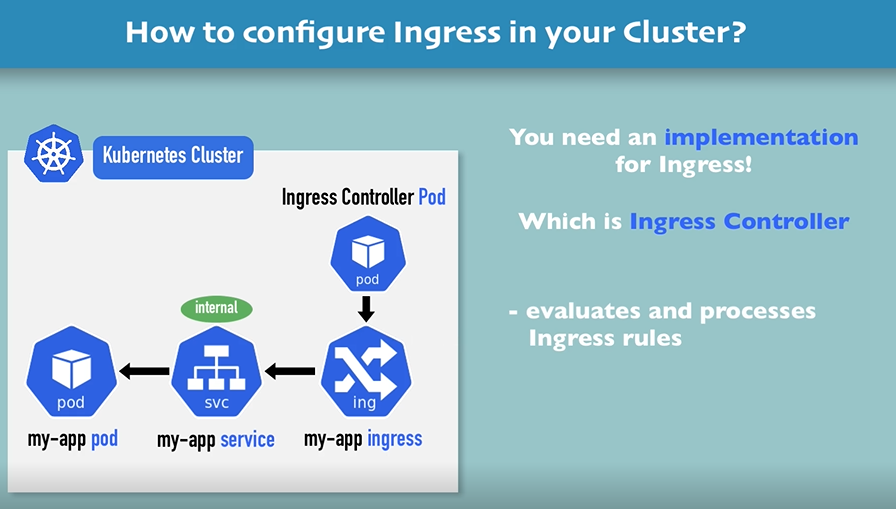
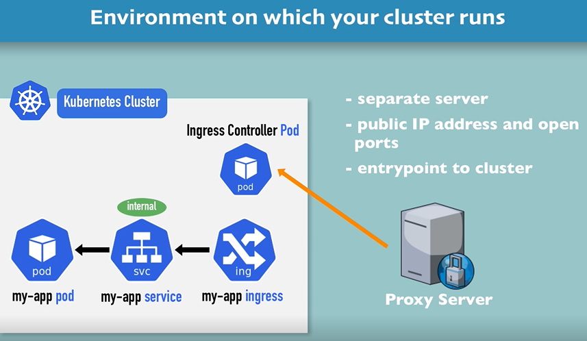
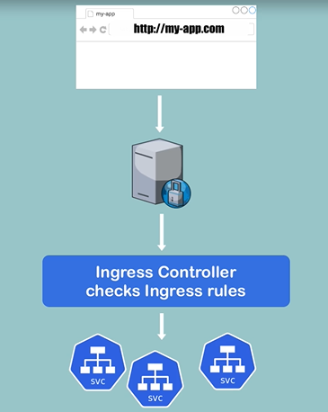

# 1st you create external srv as nodeport or loadblancer to access for application from the browser

# => this good for case testing
# for u have domain name of app and secure app with https the waay to use that using k8s component ingress for that u not able to put you app access througth the ip adress and port  of node . for that u use internel service 

# now if the req come from the browser first for the ingress and ingress we redirected for the internel server and then will indup to the pod


# we need to impliment ingress controller Pod which is ingress Controller  for evaluate and processes Ingress rules and manage redirections thhis will be the entrypoint of the cluster. 

# for the implimentation there are many third-party implimentations
# for exple for k8s:  Nginx Ingress Controller 
# RQ: with cloud provider you don't have to impliment LB by yourself! 
# u have to provide entrypoint in seprate server one of type is an externel proxy server which be soft or hard solution that will take role of LB


# 1. install ingress controller in minikube
```bash
minikube addons enable ingress
```

# 2.Create Ingress rule for k8s dashboard ns acces from the browser with domaine name 
```bash
kubectl get ns 
```
# for show all components in that ns
```bash
kubectl get all -n kubernetes-dashboard
```
# 3.Ingress for k8s dashboard
############
```bash
- apiVersion: networking.k8s.io/v1
- kind: Ingress
- metadata:
  name: dashboard-ingress
  #same ns for srv and pod
  namespace: kubernetes-dashboard
- spec:
  - rules:
    - host: dashboard.com 
      - http:
        - paths:
          - backend:
            serviceName: kubernetes-dashboard
            servicePort: 80
```
# 4.Apply ingress
```bash
kubectl apply -f dashboard-ingress.yaml
```
# 5.show
```bash
kubectl get ingress -n kubernetes-dashboard
```
# 6.assign adress to ingress in my 
```bash
sudo nano /etc/hosts
```
# in thhe end i wil difined the mapping
```bash
----------  dashboard.com
```
## RQ: ingress has a default backend that u can customize err 404
```bash
kubectl describe ingress dashboard-ingress -n kubernetes-dashboard
```
```bash
- apiVersion: v1
- kind: Service
- metadata:
  name: default-http-backend
- spec:
  - selector:
    app: default-response-app
  - ports:
    - protocol: TCP
      port: 80
      targetPort: 8080
```


