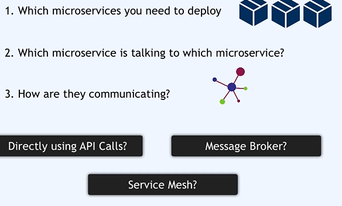
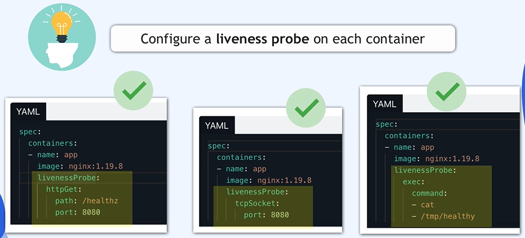
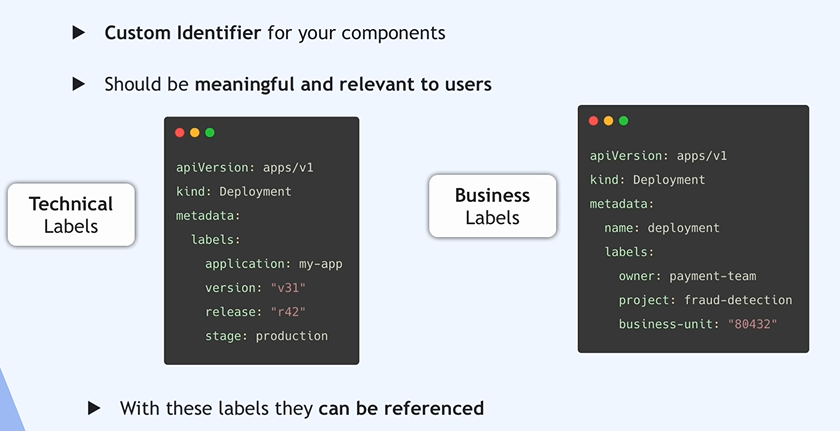

## kubernets emerged as a Plateform for Microservices Application
## from Monolith to Microservices can be developed , deployed and managed independently.
# for exple linkidin => (App1) for user services , (App2) for Messenger service ,(App3) for jobs services and (App4) for blogs service => each business functionality is encapsulated into own Microservice 'MS', Smaller independent application

# less interconnected logic
## how MS communicate => ser-to-serv API calls or through third party message broker 

## less code complexisity inside MS
## some messenger broker are redis or rabbitmq

# service Mesh achitecture => one centeral big message broker that handle al communication . Each MS has its own helper application (is a SideCar Container in kubernetes) that handle communication for that specifique MS t another MS

## one the popular services Mesh is Istio 
## you as a devops enginner your task is to deploy existing MS applications in a k8s cluster

## What information do you need from developers to be able MS to deploy in k8s cluster

## in order msg broker or service mesh which app are using .

## based to these information 

## we decide  each MS run in which ns 

## App => https://github.com/med363/microservices-demo

# Wich the entrypoint service get request from the browser 

## for testing MS 

## in the second stage we need also to know 

## on wich port 

## because u have to define that in the configuration files for deployement but also for the services to be able to connect application inside the pod.

###### volume 

## in config-v1.yaml

## best practice in config-v2.yaml

## => u should put a specific version of image

## => u should configure a liveness probe on each container

## liveness Probe is a script or a tiny prog that pings app entypoint every 5s or 10s to check the app response so it running succesfully 

## => u should configure a readiness probe on each container

prb

 ## => u should configure a resource requests for each container
 
 ## some app need more cpu and memory 
 

 
 
 
 
 
##  Don't expose a Node Port!

## the best practice 

## u should configure more than 1 Replica for Deployement

## u should configure more than 1 worker for the cluster

# u should using labels 

# u shoould using ns

# make manage cluster more easier compare to 

## Also by difine different privelege

# use should use security 

