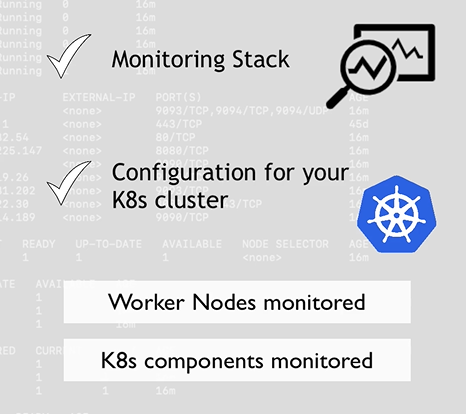
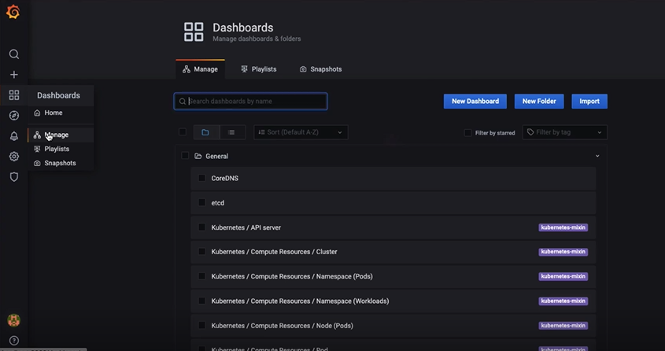

# we can use pretty dashboard like grafana

# 1st methode

# and execute them in the right order

# 2nd methode using an operator that manager of all Prometheus components

# 3th methode using Helm

# in this repo 
```bash
https://github.com/helm/charts/tree/master/stable/prometheus-operator
```
# we can give a name for charts 
```bash
helm install prometheus stable/prometheus-operator
```
# show all in cluster 
```bash
kubectl get all
```


# => kube-state-metrics keep k8s infrastructure monitoring 


# and pods coming from deployments and StatefulSets



# k8s components like pods , deployement , replicas and statefulSet.


# monted into Prometheus Pod


# => responsible for reloading , when configuration files changes


# for show port of grafana 
```bash
kubectl get pod
```
# if there are multiple container on that pod 
```bash
kubectl logs <pod> -c <container>
```




