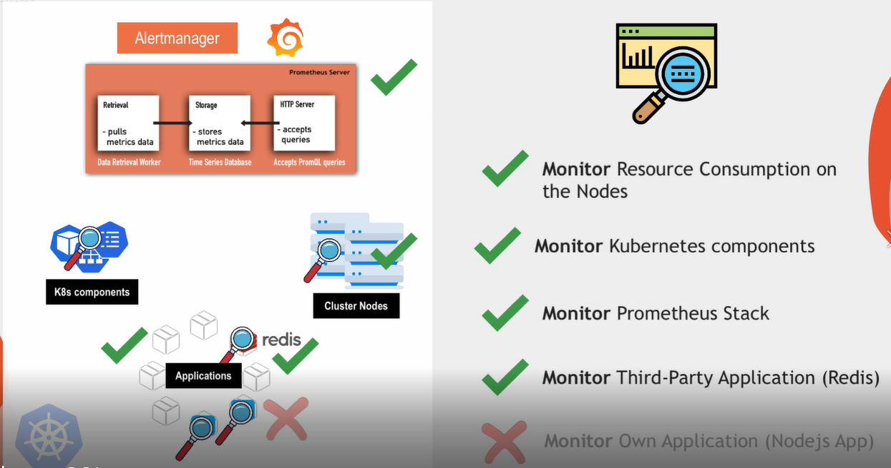
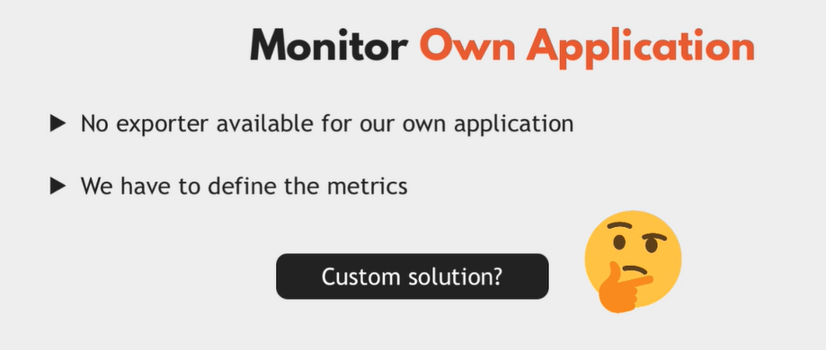
# => we need to use client libraries prometheus 
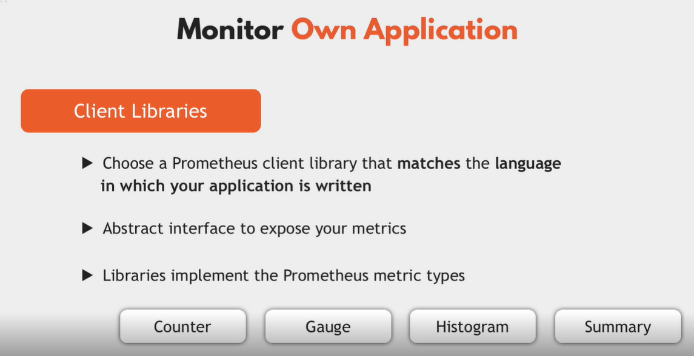
# for promming language there is own prometheus libraries
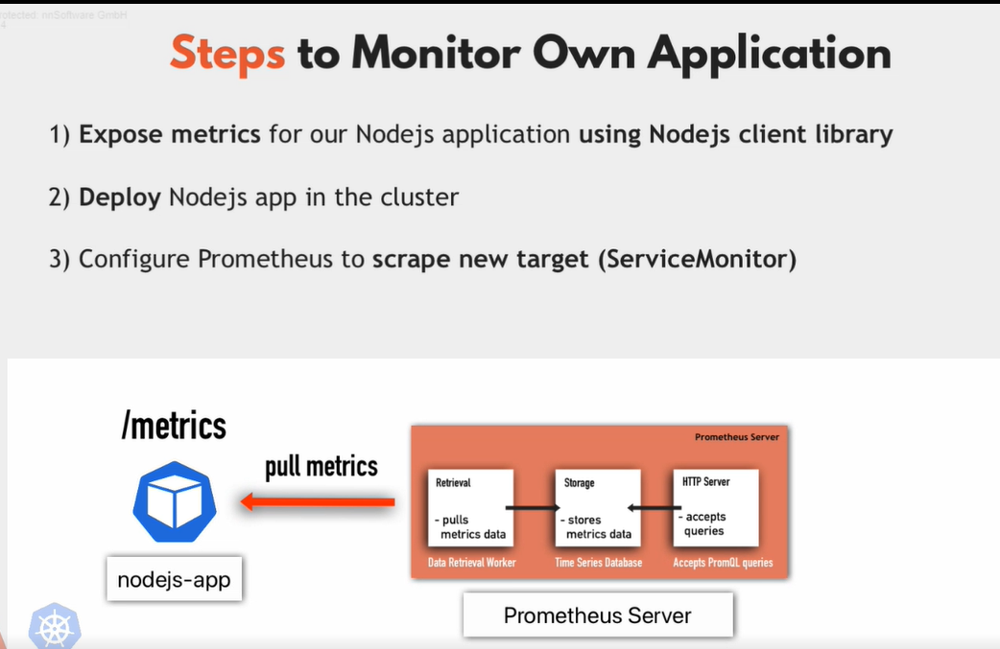
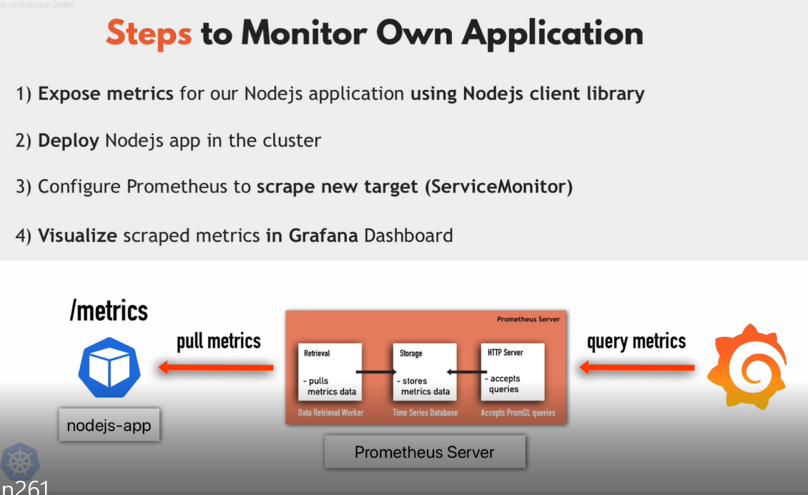
```bash 
docker pull nanajanashia/demo-app
```
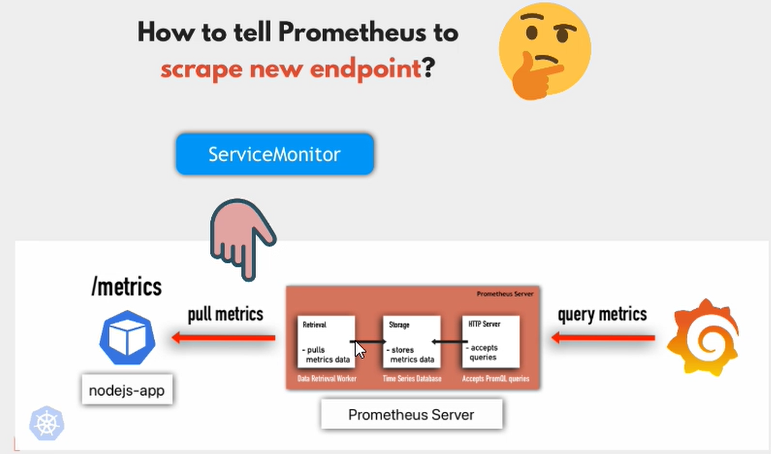
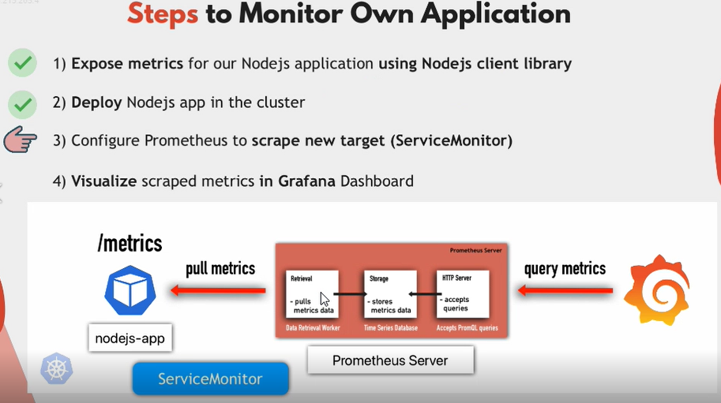
# add monitoring ns that prometheus run on it
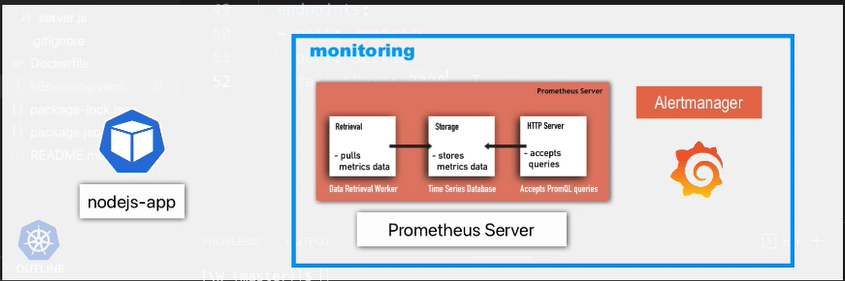
# pod run on default ns 
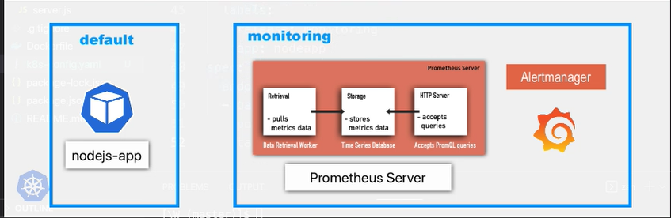
# how to see in grafana dashboard
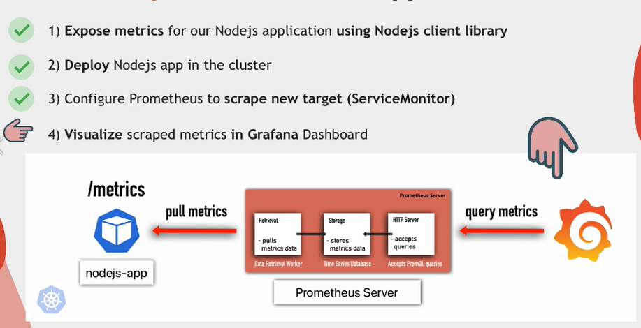
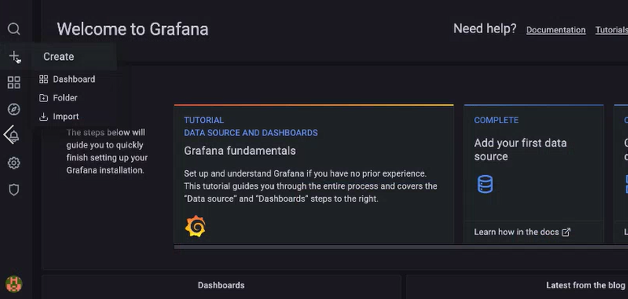
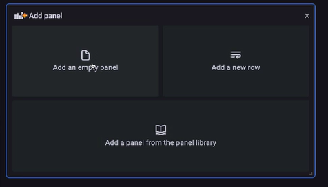
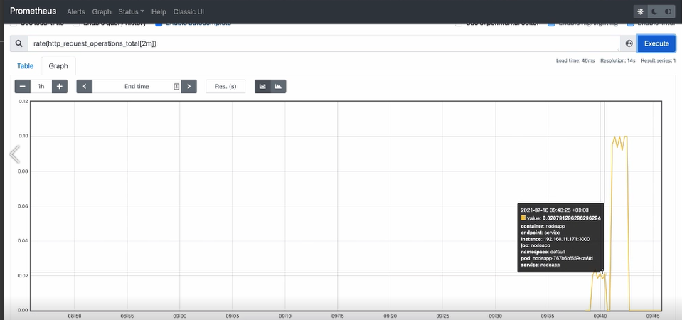
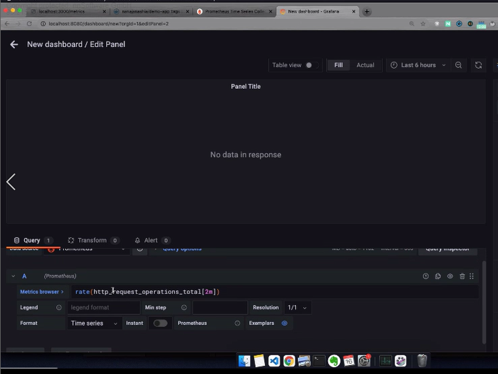
