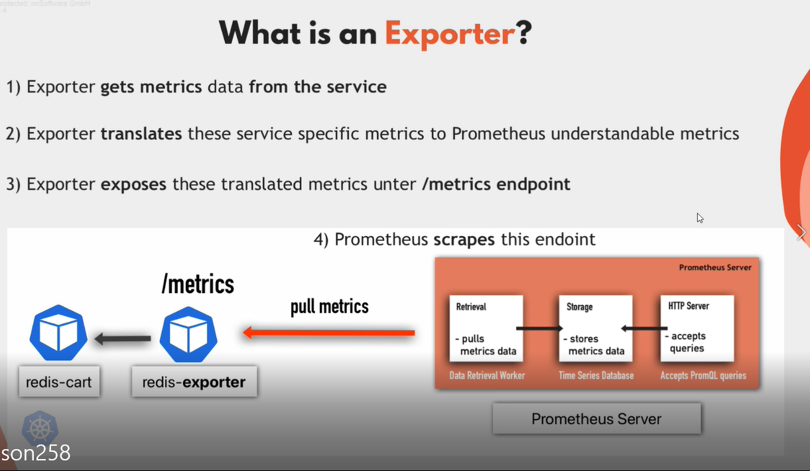
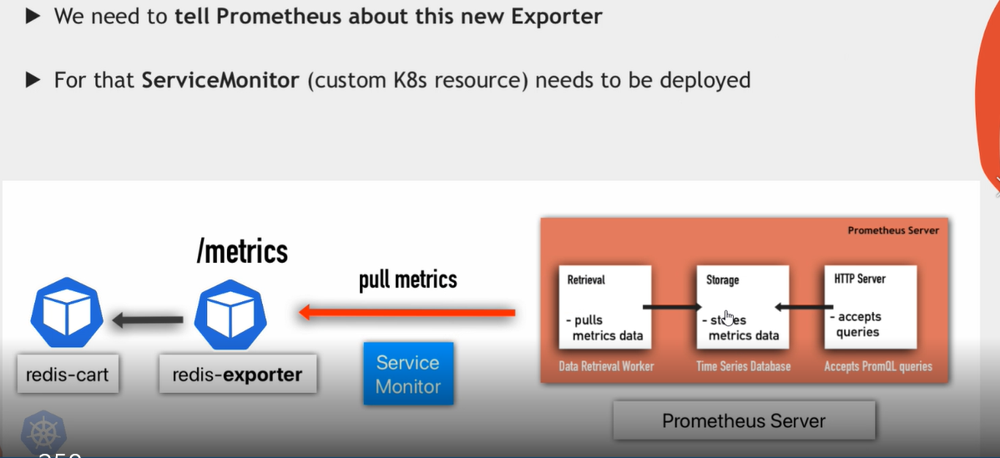
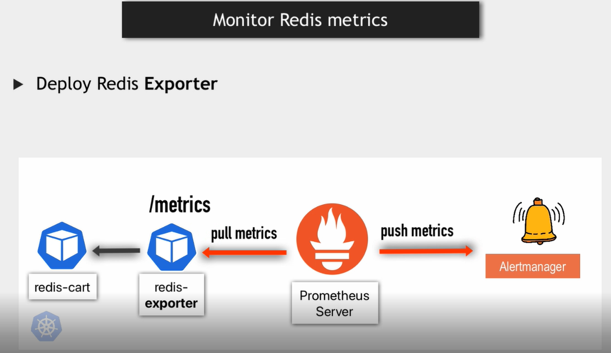
# go to this url
```bash
https://github.com/oliver006/redis_exporter
```
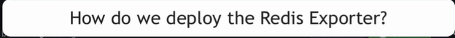
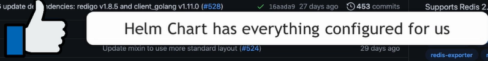
# here all helm-charts exporter
```bash
https://github.com/prometheus-community/helm-charts
```
# go to charts and search for redis
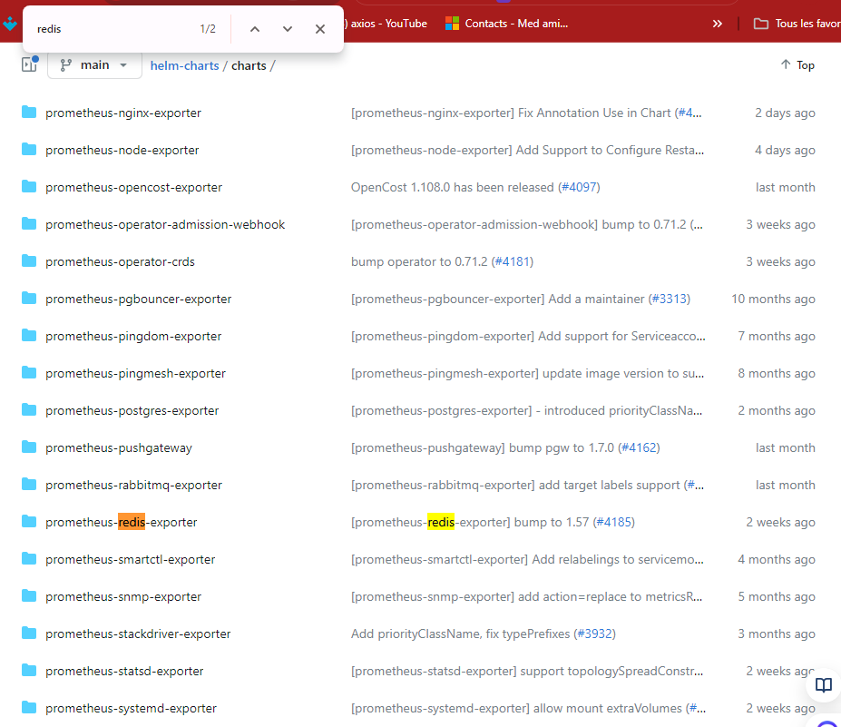
# u can see on prometheus 
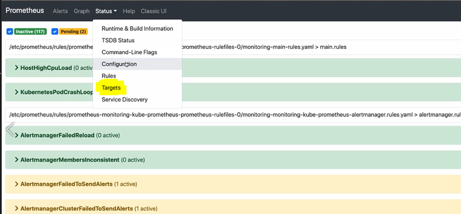
# alert
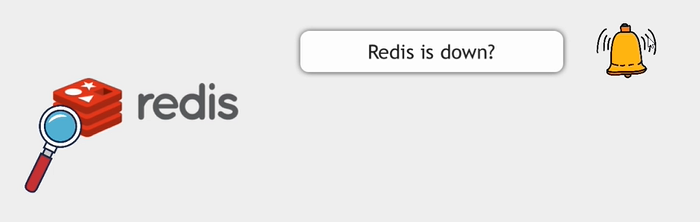
# or too many connection at once
# let's create redis-rules
#######
# we can go on => 
```bash
awesome-prometheus-alerts.grep.to
```
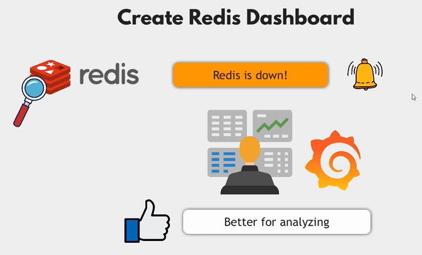
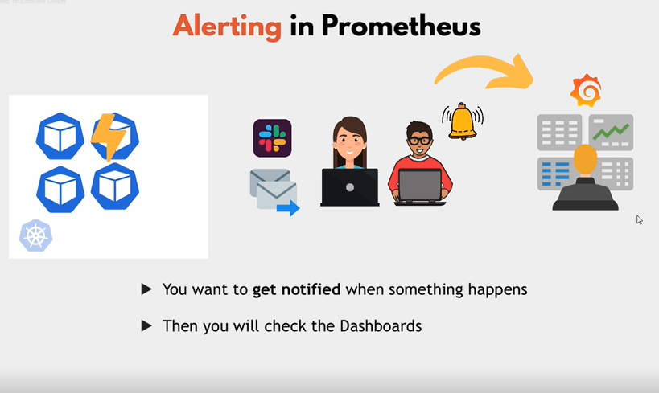
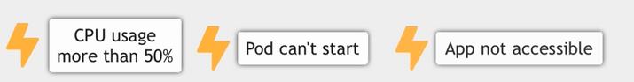
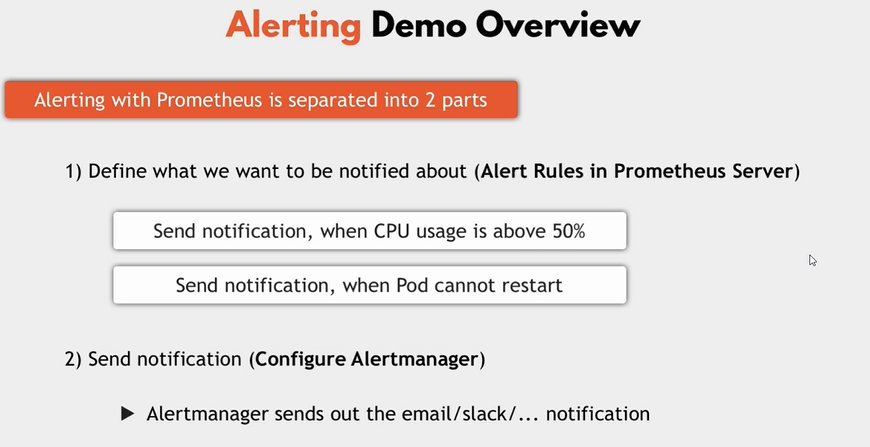
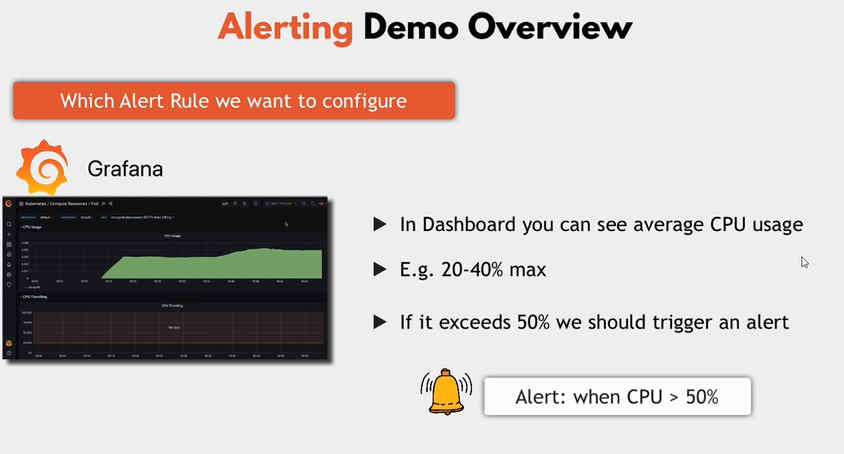 
# rq: when install prometheus stack we get some alet 
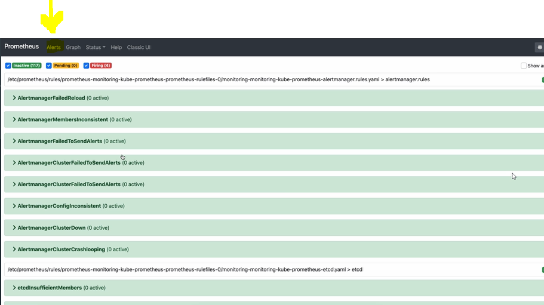
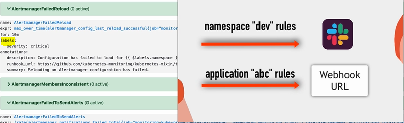
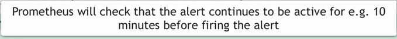

# u can go to alert k8s => 
```bash
https://github.com/kubernetes-monitoring/kubernetes-mixin/blob/master/runbook.md#alert-name-alertmanagerfailedreload
```
# now we can create a new alert rules
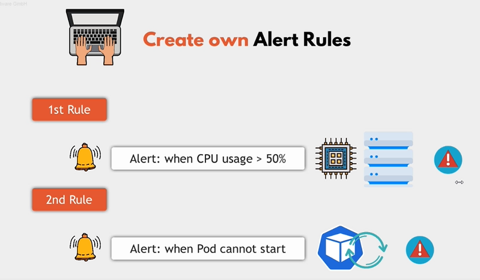 
# in alert-rules
# to prometheus consider that rule 
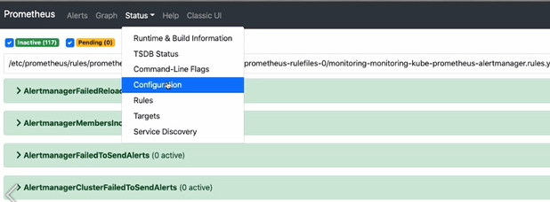
# this file have all rules
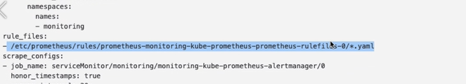
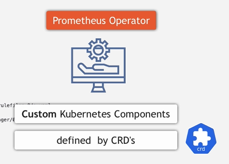
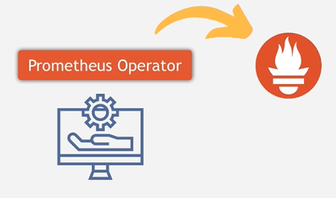
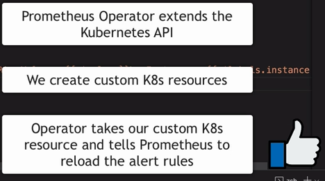
# => we defined apiVersion in alert-rules we go to docs 
```bash
https://docs.openshift.com/container-platform/4.14/rest_api/monitoring_apis/prometheus-monitoring-coreos-com-v1.html
```
# => send alert 
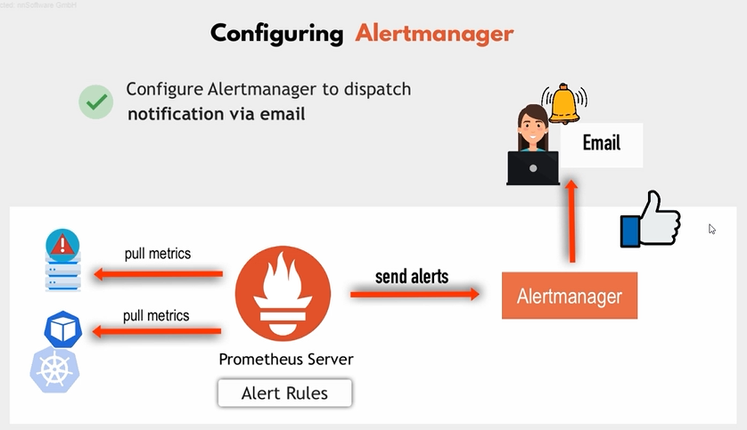
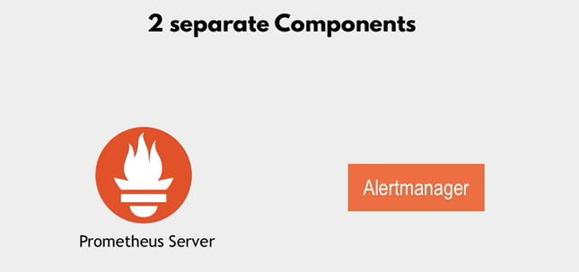
# => to go throught alertmanger
```bash
kubectl port-forward svc/monitoring-kube-prometheus-alertmanager -n monitoring 9093:9093 &
```
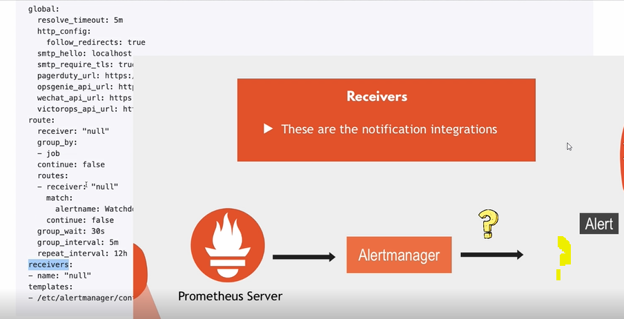
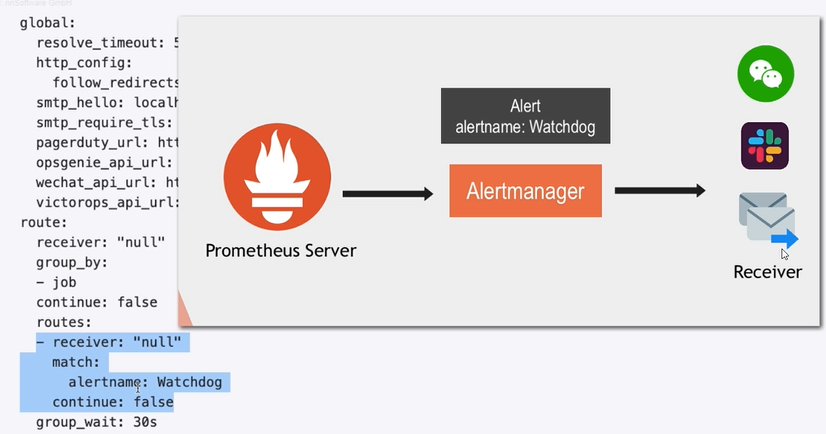
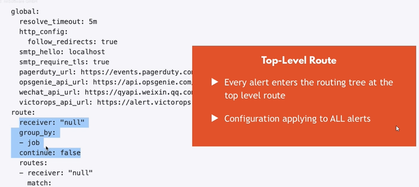
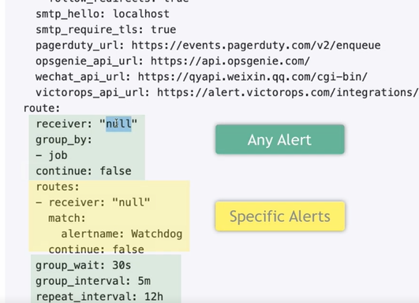
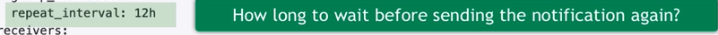
# to show the alert manager
```bash
kubectl get secret alertmanager-monitoring-kube-prometheus-alertmanager-generated -n monitoring -o yaml | less
```
# to decode secret
```bash
echo ................ | base64 -D | less 
```
 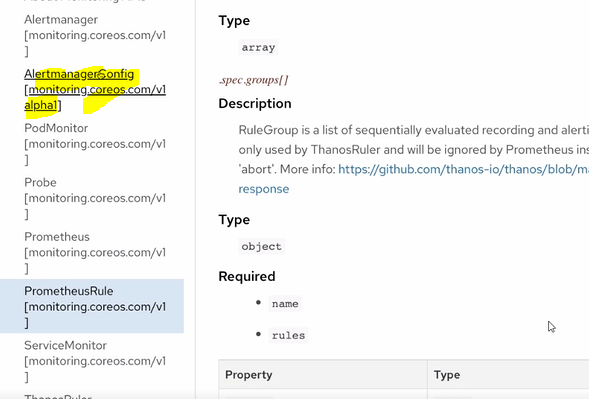
# we see configuration of notify email in alert-manager-configuration.yaml
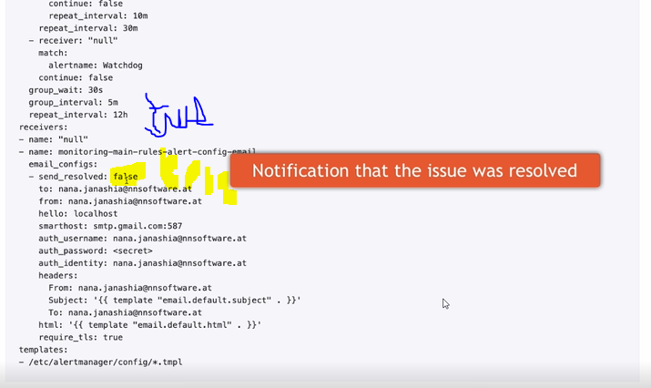
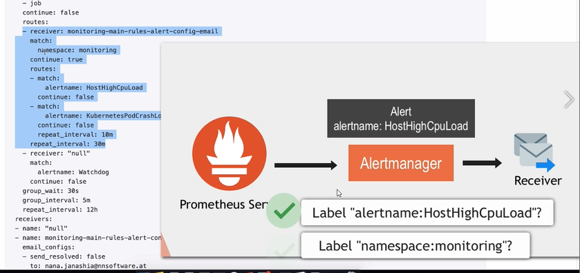
# if is match