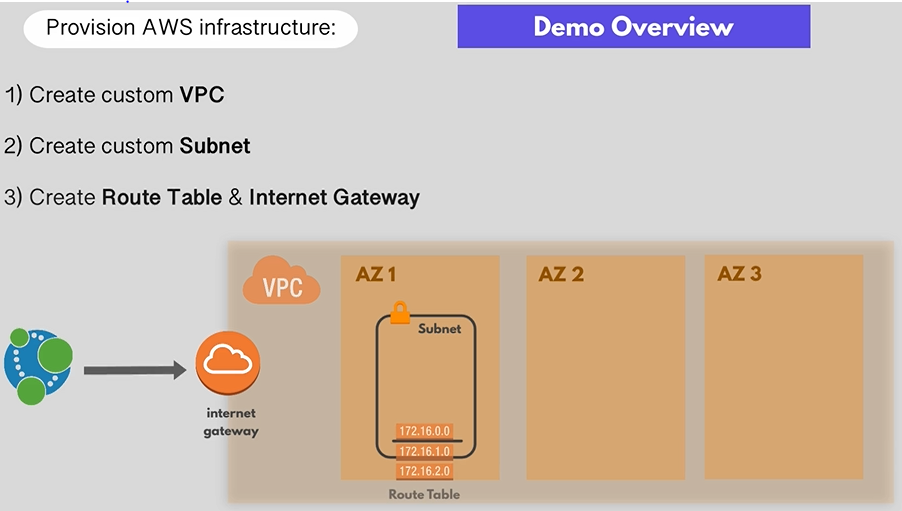
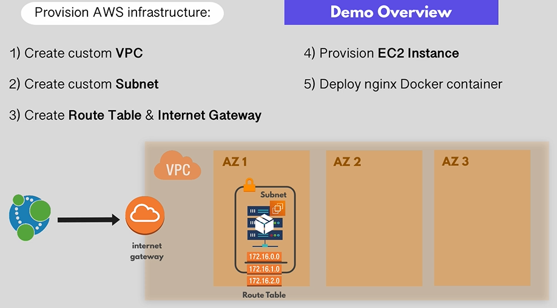
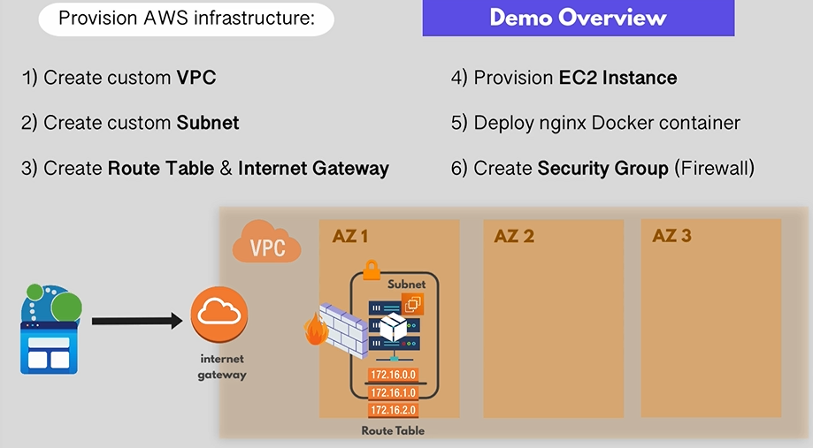

# 1. create VPC in one of region
# 2.create subnet in one of AZ 
# 3. create Route Table & Internet Gateway (connect this VPC to the internet)

## => allow to and from VPC
# 4. Inside the subnet you create EC2 instance 
# 6. Deploy nginx Docker container

# 6. create SG (firewall) in order to access to nginx from the browser

 